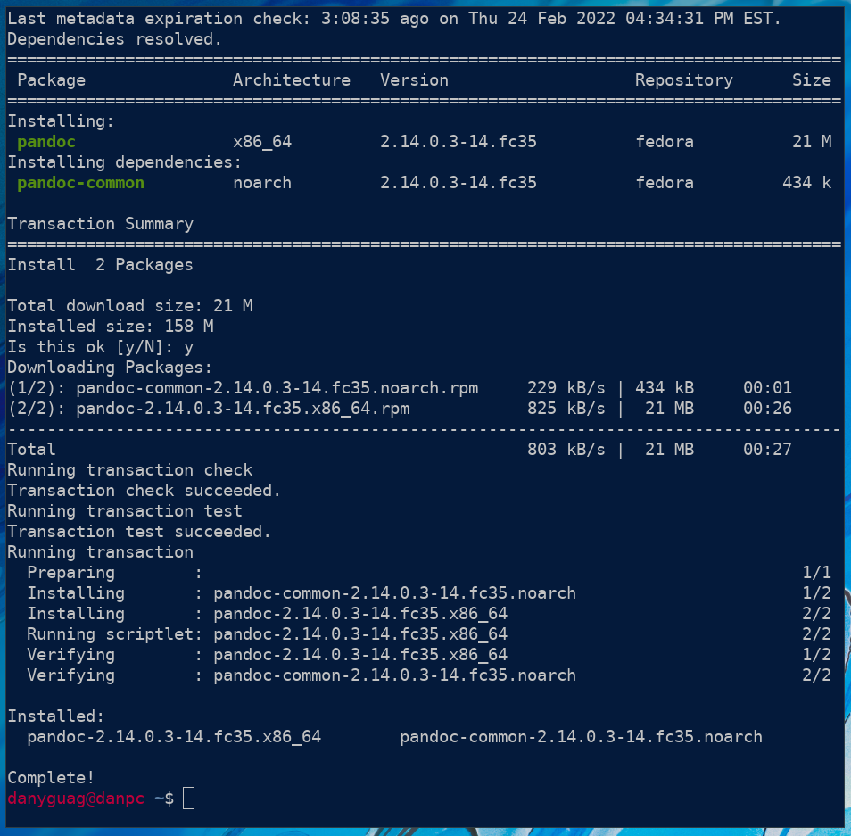

# How to Download and Install Pandoc

This guide will show you how to install Pandoc on a number of Unix variants including a number of Linux distributions and MacOS.  The requirements are listed below and since this guide is for more computer focused users it is assumed you know how to get elevated privileges.  This will first walk you through the general instructions that all Unix users need to do and then the specific commands for each different type of Unix will be listed in different sections.  Because of certain design decisions within each Unix machine it is incredibly easy to download and install Pandoc.  The steps for Arch Linux, Fedora Linux, Debian Linux, Ubuntu Linux, Void Linux, and MacOS are listed below.

## Requirements

- Logged into your Unix machine
- Administrator Privileges in a Terminal

## Steps 

1. Open a terminal.
   > **NOTE:** For an example of a terminal please check out the [Welcome Page](welcome.md).
2. Get the administrative privileges, skip this if the NOTE applies to you.
   *SKIP* If have proper privileges for `sudo` you can just prefix your installation command with `sudo`, for example: `sudo INSTALL_COMMAND`
3. Follow the steps below that are for your specific type of version of Unix/Linux, example command below.
   > **NOTE:** Because of size constraints the command was cut out of the image meaning my screen is not large enough, the command executed was `sudo dnf install pandoc`

<figure>

<figcaption>Figure 1: This is an example installation on Fedora.</figcaption>
</figure>

### Arch Linux Steps

1. You will need to run the package manager called `pacman` to install the `pandoc` package.
   > Example: `pacman -S pandoc`
2. Type `Y` or `n`  when it prompts you and asks if you really want to install this package.
   > **NOTE:** If you choose `n` the package will not be installed.

### Fedora Linux Steps

1. You will need to run the package manager called `dnf` to install the `pandoc` package.
   > Example: `dnf install pandoc`
2. Type `Y` or `n`  when it prompts you and asks if you really want to install this package.
   > **NOTE:** If you choose `n` the package will not be installed.

### Debian/Ubuntu Linux Steps

1. You will need to run the package manager called `apt` to install the `pandoc` package.
   > Example: `apt install pandoc`
2. Type `Y` or `n`  when it prompts you and asks if you really want to install this package.
   > **NOTE:** If you choose `n` the package will not be installed.

### Void Linux Steps

1. You will need to run the package manager installer executable called `xbps-install` with an argument of `pandoc`
   > Example: `xbps-install pandoc`
2. You will be prompted if you actually want to install, if you do not type `n` and if you do type `Y`.
   > **NOTE:** If you choose `n` the package will not be installed.
   
### MacOS

1. You will need to run the package manager executable called `brew` with a sub-command of `install` and an argument of `pandoc`
   > Example: `brew install pandoc`
2. You will be prompted if you actually want to install, if you do not type `n` and if you do type `Y`.
   > **NOTE:** If you choose `n` the package will not be installed.

## The End

You have successfully installed pandoc on a Unix machine! Now you can convert all the content you would like!


