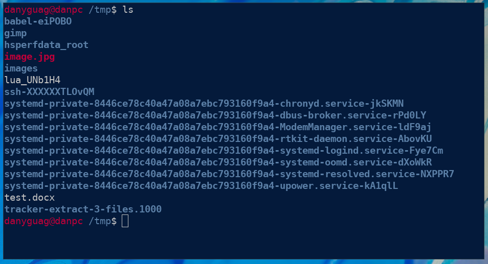
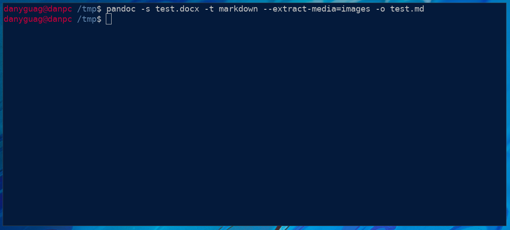

# How to Convert a Word File to a Markdown File

This guide will show you how to convert a word file, file.docx, to a Markdown file, file.md.  This guide shows you have to convert a valid word file to a Markdown file, but provides no guarantee that the Markdown file was converted exactly correctly.  You should always check your file for its validity once you have converted the word file. 

## Requirements

- A word file
- Pandoc installed

## Steps

1. Open a terminal.
   > **NOTE:** For an example of a terminal please check out the [Welcome Page](welcome.md).
2. Remember where your word file is stored at.
3. Use the `cd` command to navigate to your word file's parent directory.
   > If your file is stored at /home/user/Documents/file.docx an example command would be `cd /home/user/Documents/`
   > **NOTE:** If you are not sure you are in the right directory type `ls` and check if the file name is listed, if is you are in the correct directory. Look below at the image and notice that my document `test.docx` is in my current directory.
   > <figure>
   > 
   > <figcaption>Figure 1: Your ls output should be similar to this but with your file in it instead.</figcaption>
   > </figure>
4. Run the following command, but make sure to replace the paths that start with `test` with your markdown file name.
   > **NOTE:** If your word file does not contain images `--extract-media=images` is not necessary
   > **NOTE:** If there is output please read the message and correct the mistakes, most likely you have not specified a valid path to a word file.
<figure>

<figcaption>Figure 1: Your Pandoc command and output should look similar to this.</figcaption>
</figure>

Congratulations you have converted a word file to a Markdown file.  Now that your content is convert ensure the integrity of it before publishing or peer review.


